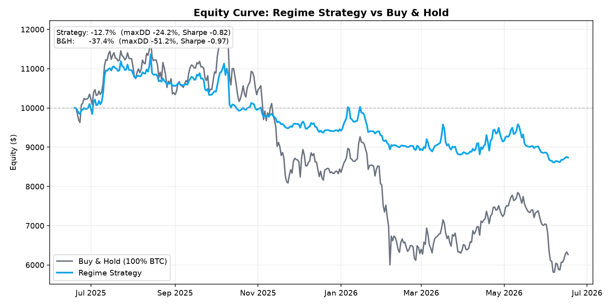
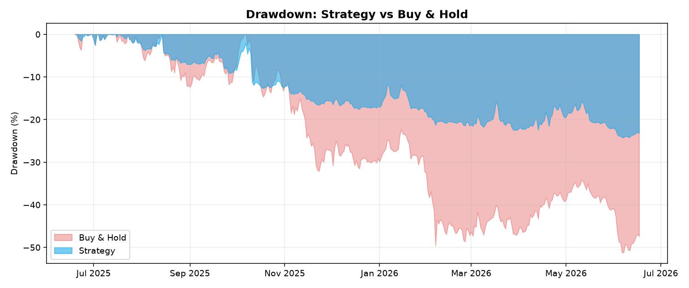
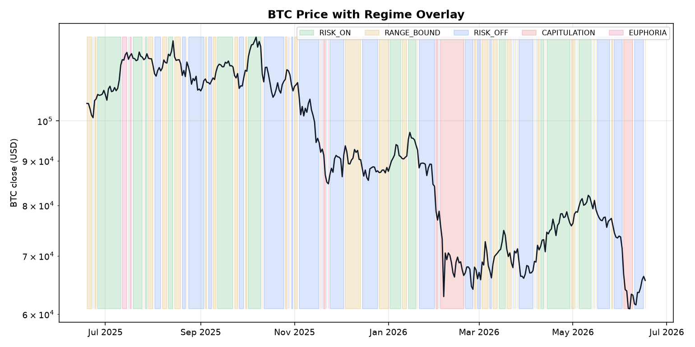
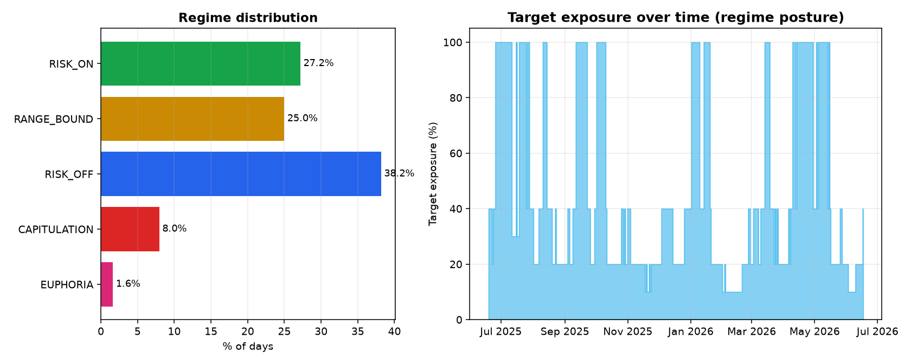

<div align="center">

# 📊 Market Regime Oracle

**A 5-signal → 5-state BTC market-regime classifier with posture mapping, backtested vs buy-and-hold.**

*Fuses momentum, sentiment, volatility, funding & flow into one explainable regime — and a documented risk posture per regime.*

[](https://www.python.org/)
[](LICENSE)
[](tests/)
[](https://dorahacks.io/hackathon/bnb-ai-trading)
[](src/market_regime_oracle/mcp_server.py)

</div>

---

## What It Does

Ask *"What kind of BTC market is this, and how much risk should I take?"*

The oracle answers with one of **5 regimes** + a documented posture:

| Regime | Target Exposure | Posture |
|---|:---:|---|
| 🟢 `RISK_ON` | 100% | Uptrend — full exposure |
| 🟡 `RANGE_BOUND` | 40% | Sideways — light exposure |
| 🔵 `RISK_OFF` | 20% | Downtrend — defensive |
| 🔴 `CAPITULATION` | 10% | Panic — max defensive |
| 🟣 `EUPHORIA` | 30% | Blow-off — take profit |

Built as an **MCP Strategy Skill** for the CoinMarketCap Agent Hub (BNB AI Trading — Track 2). Any MCP-compatible client (Claude Desktop, Cursor, CMC Agent Hub) calls `get_market_regime` to get a deterministic, no-look-ahead risk posture.

---

## 📈 Headline Result

> **In a down year for BTC (−37%), the regime strategy did −12.7% — halving drawdown (−24% vs −51%) and halving volatility (19% vs 43%), outperforming buy-and-hold by ~25 points while still going long in uptrends.**

| Metric | **Regime Strategy** | Buy & Hold |
|---|:---:|:---:|
| Total return | **−12.7%** | −37.4% |
| Max drawdown | **−24.2%** | −51.2% |
| Annualized volatility | **19.3%** | 43.1% |
| Sharpe (rf 4%) | **−0.82** | −0.97 |
| Sortino | **−1.01** | −1.32 |

*Data: CoinGecko BTC daily (2025-06-19 → 2026-06-17, 364 days). Start $10,000. 10 bps/turnover cost.*

---

## 🖼️ Visual Results

### Equity Curve — Regime Strategy vs Buy & Hold


### Drawdown — Strategy Stays Shallower


### BTC Price with Regime Overlay


### Regime Distribution & Target Exposure


---

## 🏗️ Architecture

```
  CoinGecko (BTC OHLCV)         alternative.me (Fear & Greed)
         │                              │
         └──────────────┬───────────────┘
                        ▼
             ┌─────────────────────┐
             │   data/loader.py    │  aligned daily features
             └─────────┬───────────┘
                       ▼
  ┌──────────────────────────────────────────┐
  │     5 independent signal modules         │  each → score in [-1, +1]
  │  momentum(0.30)  fear_greed(0.25)        │
  │  funding(0.15)   flows(0.15)   vol(0.15) │
  └──────────────────────┬───────────────────┘
                         ▼ weighted fusion
                  composite score
                         ▼ priority rules
  ┌──────────────────────────────────────────┐
  │   5-state regime classifier              │  CAPITULATION > EUPHORIA >
  │   (deterministic, no look-ahead)         │  RISK_OFF   > RISK_ON >
  └──────────────────────┬───────────────────┘                          > RANGE_BOUND
                         ▼
                target exposure + action
           ┌───────────────┴───────────────┐
           ▼                               ▼
    vectorized backtest                MCP tool: get_market_regime
    (no look-ahead, w/ costs)          (stdio, Agent Hub skill)
```

---

## 🧩 The 5 Signals

| Signal | Source | Weight |
|---|---|:---:|
| **RSI / MACD momentum** | CoinGecko price | 0.30 |
| **Fear & Greed Index** | alternative.me | 0.25 |
| **Volatility regime** | CoinGecko price | 0.15 |
| **Funding rate proxy** | derived from price | 0.15 |
| **Exchange flow proxy** | derived from volume | 0.15 |

Each signal outputs a normalized bullishness score in `[-1, +1]`. All 5 are independently unit-tested.

> **Transparency:** Funding rate and exchange flows have no free public feed. We reconstruct them from price/volume data as clearly-labeled proxies. Drop in real feeds anytime — the fusion layer is signal-agnostic.

---

## 🚀 Quick Start

```bash
git clone https://github.com/aggreyeric/bnb-market-regime-oracle.git
cd bnb-market-regime-oracle
pip install -r requirements.txt

# Run full pipeline: fetch → classify → backtest → charts
python main.py

# Run tests (offline, no network needed)
PYTHONPATH=src python -m pytest tests/

# Run as MCP server
PYTHONPATH=src python -m market_regime_oracle.mcp_server

# Live MCP demo (30 seconds)
./scripts/demo.sh
```

### Docker
```bash
docker compose up --build run    # full pipeline
docker compose up --build server # MCP server
```

---

## 📁 Project Layout

```
market_regime_oracle/
├── src/market_regime_oracle/
│   ├── data/          # CoinGecko + alternative.me loaders
│   ├── signals/       # 5 signal modules (unit-tested)
│   ├── classifier/    # fusion → regime mapping
│   ├── backtest/      # vectorized engine, no look-ahead
│   ├── viz/           # equity/drawdown/regime charts
│   └── mcp_server.py  # MCP stdio server
├── tests/             # 24/24 passing
├── results/           # CSVs, metrics.json, PNG charts
├── scripts/demo.sh    # live MCP round-trip
├── Dockerfile
├── docker-compose.yml
└── README.md
```

---

## 📚 Data Sources

- **CoinGecko** v3 free API — BTC daily close + volume
- **alternative.me** — Fear & Greed Index

Both public, both free. **No API keys required.**

---

## 📜 License

[MIT](LICENSE) © 2026
