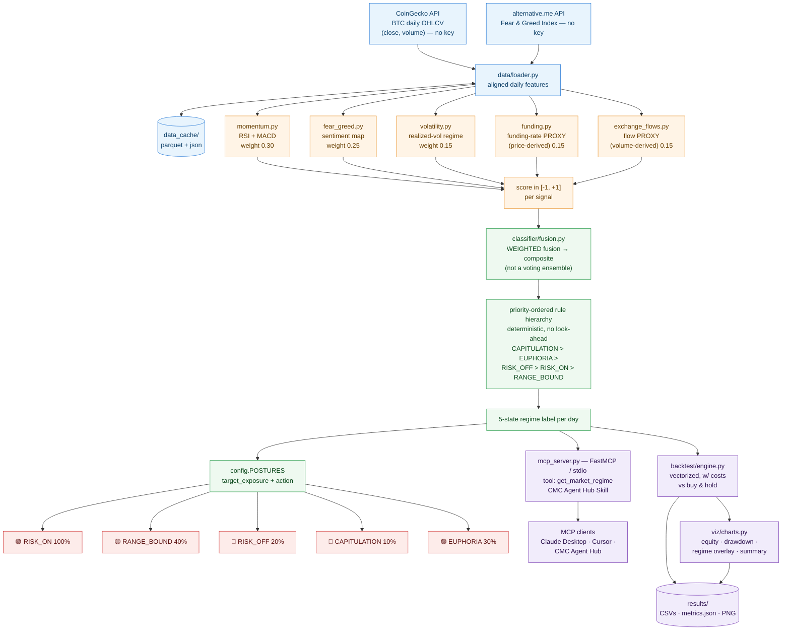

# Architecture — Market Regime Oracle

> Scope note: this document reflects the **actual implementation** in `src/`. The
> task brief referenced on-chain DEX data, a voting ensemble, a 4-state
> Bull/Bear/Sideways/Risk-Off output, and a BSC smart-contract integration —
> **none of those exist in the codebase.** The diagram below documents what is
> really shipped. See [§ Reconciliation](#-reconciliation-task-brief-vs-actual) for
> the itemized diff.

---

## System Overview



---

## The 5 Signals

| # | Module | Signal | Source | Weight |
|---|---|---|---|:---:|
| 1 | `signals/momentum.py` | RSI + MACD momentum | CoinGecko price | **0.30** |
| 2 | `signals/fear_greed.py` | Fear & Greed Index | alternative.me | **0.25** |
| 3 | `signals/volatility.py` | Realized-vol regime | CoinGecko price | 0.15 |
| 4 | `signals/funding.py` | Funding-rate **proxy** (price-derived) | derived | 0.15 |
| 5 | `signals/exchange_flows.py` | Exchange-flow **proxy** (volume-derived) | derived | 0.15 |

Each signal normalizes to a bullishness score in `[-1, +1]`. Signals 4 and 5 are
clearly labeled **proxies** — there is no free public funding/flow feed, so they
are reconstructed from price/volume. The fusion layer is signal-agnostic, so real
feeds can be dropped in without touching the classifier.

---

## Classifier: Fusion + Priority Rules (not voting)

```
composite = Σ(weight_i × score_i)
```

The composite is then mapped to **exactly one** regime via a deterministic,
priority-ordered rule hierarchy (no look-ahead, no randomness):

1. **CAPITULATION** — highest priority (extreme fear + crash)
2. **EUPHORIA** — extreme greed + blow-off
3. **RISK_OFF** — composite strongly negative
4. **RISK_ON** — composite strongly positive
5. **RANGE_BOUND** — default (neutral / sideways)

---

## 5 Regimes → Posture Map

| Regime | Target Exposure | Posture |
|---|:---:|---|
| 🟢 `RISK_ON` | 100% | Uptrend / accumulation — full exposure |
| 🟡 `RANGE_BOUND` | 40% | Sideways — light exposure, hold core |
| 🔵 `RISK_OFF` | 20% | Downtrend / defensive — raise cash to 80% |
| 🔴 `CAPITULATION` | 10% | Panic / max defensive — near-full cash |
| 🟣 `EUPHORIA` | 30% | Blow-off top — take profit, fade strength |

---

## Integration Surface

- **MCP Strategy Skill** — `mcp_server.py` exposes `get_market_regime` over stdio
  via FastMCP. Any MCP client (Claude Desktop, Cursor, the CoinMarketCap Agent
  Hub) gets a deterministic regime + posture snapshot for the latest day.
- **Vectorized backtest** — `backtest/engine.py` replays the regime labels with
  realistic costs (10 bps/turnover) against buy-and-hold.
- **Visualization** — `viz/charts.py` emits equity curve, drawdown, regime
  overlay, and regime-summary PNGs to `results/`.

---

## 🔁 Reconciliation: Task Brief vs. Actual

| Task brief said | Actual implementation |
|---|---|
| Data source: on-chain DEX data | ❌ Not present. Only CoinGecko + alternative.me |
| Signal: `volume` (standalone) | ⚠️ Replaced by `volatility` + volume-derived `exchange_flows` proxy |
| Signal: `on-chain flow` | ⚠️ `exchange_flows` is a volume-derived **proxy**, not on-chain |
| Classifier: ensemble **voting** | ❌ Weighted **fusion** + deterministic priority rules |
| Output: Bull / Bear / Sideways / Risk-Off (4) | ❌ 5 states: RISK_ON / RANGE_BOUND / RISK_OFF / CAPITULATION / EUPHORIA |
| Integration: BSC smart contract | ❌ **Not implemented.** MCP stdio + backtest only — no on-chain contract, no auto-execution |
| Integration: automated trading signals | ⚠️ Regime + posture is *advisory* (target exposure); no order execution layer |

If the on-chain/BSC piece is required for submission, it is a **new build**,
not documentation of existing code.
